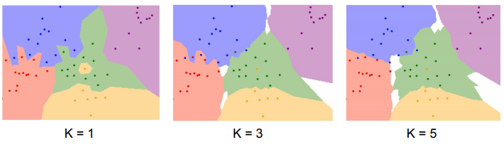
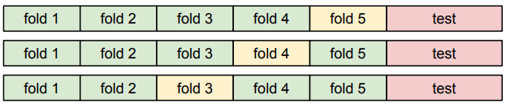
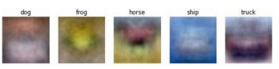
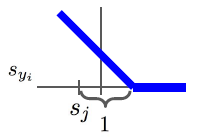
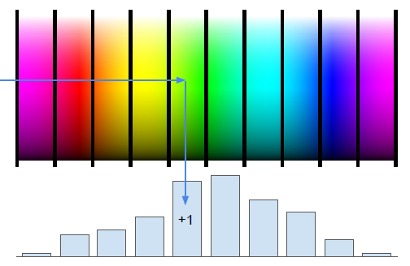
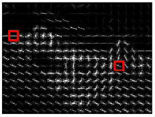
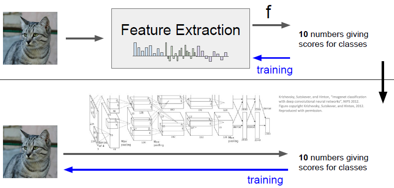

# CS231n 정리 노트

* 수강하면서 적당히 정리해 놓는 노트
* 모든 내용과 자료는 [스탠포드 CS231n 강의](http://cs231n.stanford.edu/)에서 퍼온 것  
  (All contents and resources are from [Stanford University CS231n](http://cs231n.stanford.edu/))

## 글 쓸 때 유의할 것

* github readme랑 github pages에서 동시에 렌더링 되기 위해서 몇가지 주의해야 함
* \|는 pages에서 table로 rendering 될 수 있으므로 주의(latex 링크를 quote해서 첨부할 것)
* 이미지는 경로를 /로 시작하지 말고 폴더명부터 시작할 것

# Lecture 2: Image Classification Pipeline

* Image Classification이란 이미지를 보고 그것이 속한 카테고리를 분류하는 것 (예. 고양이 사진 -> "cat")
* 인간의 뇌로는 쉽지만 컴퓨터는 각 픽셀의 RGBA 값 밖에 몰라서 어렵다.
  * Viewpoint variation: 카메라가 이동하거나
  * Illumination: 조도가 변하거나
  * Deformation: 같은 물체가 평소랑 다른 모습으로 있을 수도 있고
  * Occlusion: 다른 물체랑 겹칠 수도 있고
  * Background Clutter: 배경색이랑 비슷할 수도 있고
  * Intraclass variation: 같은 class에 속해도 각양각색일 수 있음
* Edge detection -> corner detection과 같은 vision-based algorithm이 사용되기도 한다
* 여기서는 data-driven approach로서 기계학습을 사용한다
  * 데이터 모으고 -> classifier 훈련시키고 -> 새로운 이미지에 그 classifier를 사용한다
  * CIFAR10이라는 dataset은 10 class로 나뉜 약 50,000개의 training image와 10,000개의 test image가 있다
  
## KNN
* 가장 단순한 방법은 nearest neighbor를 고려하는 것
* 거리를 측정하는 방법은 여러가지
  * L1 distance metric 
  * L2 distance metric =\sum_p{\sqrt{(I_1^p-I_2^p)^2}})
  * L1은 좌표계 rotation에 invariant하지 않음
* 시간복잡도
  * 그냥 training set을 저장해두면 훈련 끝 O(1)
  * 대신 predict할 때 모든 저장된 걸 다 봐야해서 O(N)이다
  * 보통 training 오래 걸리는 건 감당할 만한데 predict 오래 걸리면 곤란해서 별로다
* 제일 가까운 이웃 하나만 고려하면 generalizable한 decision boundary가 형성되지 않음
  * outlier가 자신만의 local area를 구축하기 때문
* 그래서 K개의 가까운 이웃을 보고, 그 중에 가장 많이 속한 category로 예측함 (KNN)  
 
 
* Image classification에선 사실 안 씀
  * 이유 1: 지각적으로 다르게 느껴지는 것과, L1이나 L2 거리가 상관이 없음
    * 사람 사진에 마스크 씌우고 조도 좀 낮추면 distance 0으로 만드는 게 가능함
  * 이유 2: KNN은 instance space를 조밀하게 representative들이 채우고 있어야 말이 되는데, 차원 늘어날 수록 조밀하게 채우기 위해 필요한 원소의 수가 지수증가함.

## Hyperparameter
* KNN에서 K의 값이나, distance metric의 종류 같은 건 미리 정해서 프로그램을 돌려야 하는데 이런 걸 hyperparamter라고 부름
* Idea #1: 원래 데이터에 가장 잘 맞는 hyperparameter 선택하기
  * Overfitting 되기 때문에 안 좋음. 예를 들어 이 경우 K=1인 KNN이 선택됨.
* Idea #2: train & test set으로 나눠서, train에서 훈련하고 test set에서 가장 성능 좋은 거 선택하기
  * 이것도 일종의 overfitting이라 안 좋음. test set이 아니라 실제 새로운 데이터가 들어올 때 어떻게 될지 모름.
* 결론: train & valid & test set의 세 종류로 나눠서, train에서 훈련하고, valid에 제일 좋은거 선택하고, test에는 딱 한 번 돌려보고 운명을 받아들이기
* Cross-validation은 training set에서 valid set을 하나로 특정하지 않고, valid set을 달리 해가며 여러번 돌리고 평균값을 취하는 접근법.
  * dataset 작으면 쓸만 한데, 딥러닝에선 잘 안 쓴다  
  
* 여러 hyperparameter에 대해 돌려보고 plotting 해보면 뭘 골라야 하는지 감이 옴.

## Linear Classification
* 간단해 보이지만 콤비네이션 하면 뉴럴넷이 되므로 중요.
* Parametric approach: training data로부터 정보를 추출해서 parameter에 저장해두고, predict할 땐 그것만 사용함.
  * )
* Linear classifier는 아주 간단하게 =Wx+b)임. 여기서 는 이미지를 일차원으로 쭉 늘어뜨린 벡터.
* 직관적으로 해석하면, i번째 클래스에 속할 점수를 라고 할 때 가 되기 때문에 가 template같은 느낌이 됨.
  * 는 bias로서 특정 카테고리에 속할 확률이 높은 경우 (예. 데이터셋이 고양이만 99만마리) 보정해주기 위함
  * 클래스당 template이 하나 밖에 없기 때문에 average가 취해질 수밖에 없고, 그래서 설명력이 제한적임.  
  

* 다른 관점에서는, 를 hyperplane으로 생각하면, 각각의 hyperplane들과 의 교선들이 대강 그 클래스에 속하는 것과 그 클래스가 아닌 것을 양분한다고 볼 수 있음
  * 그렇기 때문에 parity check (1, 3사분면은 class 1이고 2, 4사분면은 class 2)나, 원형이거나, 같은 class가 전혀 다른 곳에서 두 개 이상의 cluster를 이루거나 할 때 liner classifier는 곤란해짐

# Lecture 3: Loss functions and Optimization

## Loss function

* Parametric approach에서 는 score라고 부르고, 현재 score가 얼마나 좋은지를 loss function으로 판단한다.
  * Loss는 판단 기준이 될 뿐, 예측할 땐 score 제일 높은 걸 선택하는 것이니 헷갈리지 않게 주의. 예측할 때 softmax를 계산하고 그럴 필요 없다.
* Loss는 크게 두 가지로 나눠볼 수 있다.
  * Data loss: 현재 모델의 예측이 실제 정답과 떨어진 정도.  
    
  * Regularization loss: 현재 모델의 복잡성.  
    
    *  : regularization strength (hyperparameter)
    * 는 보통 L2나 L1 사용.
  * Regularization loss는 대부분 비슷하게 L2인 을 쓰고, Data loss의 종류가 모델의 정체성을 결정한다.
* SVM loss
  * SVM(Supporting Vector Machine)은 정답의 score가 오답의 score들보다 특정한 margin 값(대부분 1) 이상 차이나기를 지향한다.
  * 
  * 그래프가 이렇게 생겨서 hinge loss라고 부름.  
  
* Softmax loss
  * SVM은 margin 이상 차이나면 신경쓰지 않는 것에 반해, softmax는 차이가 더 벌어지는 것을 선호한다.
  * Score를 확률로 해석하기 위해 exp를 씌운 후 normalization하고, distance를 계산할 때는 -log를 씌운다
    * 
    * log를 씌우는 이유는 information theory와 관련이 있는듯

## Optimization

* Loss가 작은 parameter를 찾는 과정을 optimization이라고 부른다.
* Random search는 말도 안 되니까, gradient를 구해서 그 반대 방향으로 이동하는 접근을 취하는데 이를 gradient descent라고 한다.
  * 의 gradient는 최대 증가 방향
  * 이고 여기서 는 learning rate로 상당히 중요한 hyperparameter
* Numerical하게도 구할 수 있지만 모든 의 성분에 대해 하는 것이 오래 걸리기 때문에, 해석적으로 gradient를 구한다.
* 그리고 Loss를 계산하려면 모든 input data에 대해 계산해야 하는데 이러면 오래 걸리니까, 랜덤하게 mini batch를 샘플해서 gradient descent를 하고, 이를 SGD(Stochastic Gradient Descent)라고 부른다.

## Image features

* raw pixel 말고 이미지의 high-level feature를 계산해서 학습시키면 더 잘 되기도 한다.
* Color histogram: hue에 따라 aggregate하고 binning해서 히스토그램으로 나타낸 것  
  
* Histogram of Oriented Gradients(HoG): 이미지를 patch로 쪼개고, 각 patch에 대해 몇 가지 방향의 gradient 세기를 구해 놓은 정보
  * 기울기 정보랑 위치 정보가 연합되어 저장된 형태  
  
* Bag of Words: 이미지에서 patch를 적당하게 랜덤 추출해서 codebook처럼 사용하는 것. 이 경우 feature는 차원이 word의 갯수인 히스토그램.
* 과거에는 feature extraction이 유행했는데, 요즘은 CNN이 feature extraction 작업을 암묵적으로 해주고 있다.  
  
